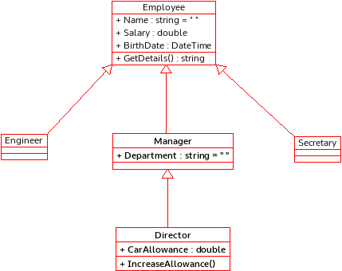

# Understanding Inheritance in C#
    

      Inspired from biological modeling, inheritance allows new classes to be constructed that inherit characteristics (fields and methods) from ancestor classes while typically introducing more specialized characteristics, new fields, or methods. A subclass is logically considered to be a specialized version or extension of its parent and by inference its ancestor classes.
 

      

        In programming, you often create a model of something, and then need a more specialized version of that original model. 
      

      
<b>Fig 1. Shows the UML class diagrams that model the Employee and Manager classes.</b>
 
      

 
      

        These codes illustrate the duplication of attributes between Manager class and the Employee class. Additionally, there could be a number of methods applicable to both classes.
          In object-oriented languages, special mechanisms are provided that enable you define a class in terms of a previously defined class.
      

      

      One of its main mechanism is called <i>Inheritance</i>. <i>Inheritance</i> is a form of software reusability in which classes are created by absorbing an existing class’s data and behaviors and embellishing them with new capabilities.
      The next figure shows the diagram in which the <i>Manager</i> is a derived class of <i>Employee</i> base class.
      

      
<b>Fig 2. Class diagram using Inheritance.</b>
 
      

      <h3>Single Inheritance</h3>
      
The C# programming language permits a class to extend one other class only. This restriction is called single inheritance. With single inheritance, a class is derived from one base class. C# does not support multiple inheritance.

      

        Once created, each derived class can become the base class for future derived classes. Typically, the derived class contains the behaviors of its base class. Therefore, a derived class is more specific than its base class and represents a more specialized group of objects.
      

      

        The next image shows the base class Employee and three derived classes: <i>Engineer</i>, <i>Manager</i> and <i>Secretary</i>. The <i>Manager</i> is also the base class from which the derived class <i>Director</i> explicitly inherits.
      

      
<b>Fig 3. An example Inheritance tree.</b>
 
      

 
      

        The <i>Employee</i> class contains three attributes (Name, Salary, and BirthDate), as well as one method (GetDetails). The <i>Manager</i> class inherits all of these members and specifies an additional attribute, department, as well as the <i>GetDetails</i> method. The <i>Director</i> class inherits all of the members of <i>Employee</i> and <i>Manager</i> and specifies a CarAllowance attribute and a new method, IncreaseAllowance.
      

